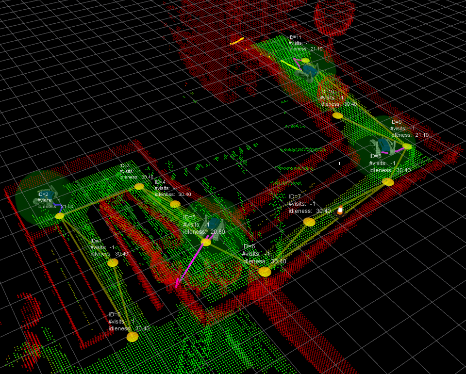
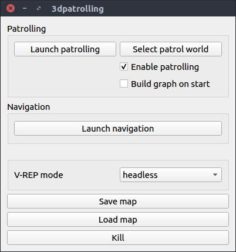

# 3dpatrolling

**Authors**: Luigi Freda, Mario Gianni, Fiora Pirri, Abel Gawel, Renaud Dubé, Roland Siegwart and Cesar Cadena

**Maintainer: [Luigi Freda](https://www.luigifreda.com)** 

This repository provides part of the C++ implementation behind our paper titled **3D Multi-Robot Patrolling with a Two-Level Coordination Strategy**. The software allows to test the proposed multi-robot strategy within a [V-REP](http://www.coppeliarobotics.com/) simulation environment. The multi-robot laser SLAM implementation is available [here](https://github.com/ethz-asl/laser_slam).   

### Related publications

Please cite this work if you make use of our system in your projects:
 
**[3D Multi-Robot Patrolling with a Two-Level Coordination Strategy](http://www.luigifreda.com/pubs/Freda%20-%203D%20Multi-Robot%20Patrolling%20with%20a%20Two-Level%20Coordination%20Strategy%20-%20AURO%202018%20-%20pub.pdf)**   
*L. Freda, M. Gianni, F. Pirri, A. Gawel, R. Dubé, R. Siegwart, C. Cadena*   
Autonomous Robots, Springer, 2018.

### Project webpage 

Videos and other information can be found on the [project webpage](https://sites.google.com/a/dis.uniroma1.it/3d-cc-patrolling/).  

 

----
## Prerequisites

We designed and tested the framework under **Ubuntu 14.04**. We recently ported it on Ubuntu **16.04**. It should be easy to compile the framework in other platforms. 

---
## How to install and compile 3dpatrolling

Here you can find a quick install procedure (tested under *Ubuntu 16.04*). Open a new terminal and get into the root folder of this repo. Run the following commands: 
* install V-REP, ROS dependencies and everything is required
`$ ./install.sh`
* compile the two workspaces `mapping_ws` and `patrolling_ws`
`$ ./compile-all.sh`
* source the workspaces by using 
`$ source source-all.bash`

Now, you're ready to test the *patrolling system* or *the path planner* (see the next sections). If something goes wrong, please, sumbit an issue. 

You can find some manual installation details in the file [INSTALL.md](./INSTALL.md).

----
## Overview

3dpatrolling is a stack of ROS packages organized in two main workspace folders (with suffix `_ws`): 
* `mapping_ws` : its `src` folder collects packages used for volumetric mapping
* `patrolling_ws`: its `src` folder collects the following subfolders:   
    - `msgs`  (custom message descriptions)
    - `multirobot` (patrolling)
    - `nav` (path planning and navigation)
    - `robot` (robot description and low level processes)
    - `vrep` (vrep tools)

###  Main scripts

Open a new terminal and from the root folder of this repo you can:

- source the workspaces by using the command
`$ source source-all.bash`

- clean the workspaces by running
`$ ./clean-all.sh `

- compile all the workspaces
`$ ./compile-all.sh `

* launch the patrolling or the path planner systems by using a **PyQt GUI** (python3 required, please read the documentation below before starting)   
`$ ./main.py` 

Once you have sourced the workspaces, you're ready to test the *patrolling system* and the *path planner* (see the next sections).

----
## Test the patrolling system 

See this [README.md](patrolling_ws/src/multirobot/README.md) file.

 

----
## Test the path planner

See this [README.md](patrolling_ws/src/nav/README.md) file.

----
## 3dpatrolling Qt GUI 

You can launch the patrolling system or the path planner system by using the 3dpatrolling PyQt GUI. Open a new terminal, enter in the root folder of the repo `3dpatrolling` and run:  
`$ ./main.py` 

Read the patrolling [README.md](patrolling_ws/src/multirobot/README.md) and the path planner [README.md](patrolling_ws/src/nav/README.md) for further details on the available options.

----
## License

The **3dpatrolling** stack contains different ROS packages. Each package comes with its own license. Where nothing is specified, a [GPLv3 license](./license/license-gpl.txt) applies to the software. 

----
## Contributing to 3dpatrolling

We would be very grateful if you would contribute to the code base by reporting bugs, leaving comments and proposing new features through issues and pull requests. Please  feel free to get in touch at *freda(at)diag(dot)uniroma1(dot)it*. Thank you!

**Note**: the 3dpatrolling software was extracted from the private [TRADR](http://www.tradr-project.eu/) repository. In order to prepare and open source the patrolling system (reducing dependencies and make it a self-contained framework), a substantial amount of refactoring was carried out and some functionalities were rewritten. Although great care was taken during this process, it is possible we introduced performance regressions and these have not been discovered yet.

----
## Credits 

Some of the packages in the folders `patrolling_ws/src/robot` and `patrolling_ws/src/msgs`have been developed by the [TRADR team](https://www.luigifreda.com/wp-content/uploads/2018/04/IMG-20180321-WA0009-1024x768.jpg). Thanks to all the guys that shared with us cold tents, hot coffee and wonderful life moments during TRADR demos, integrations, exercises and reviews!

